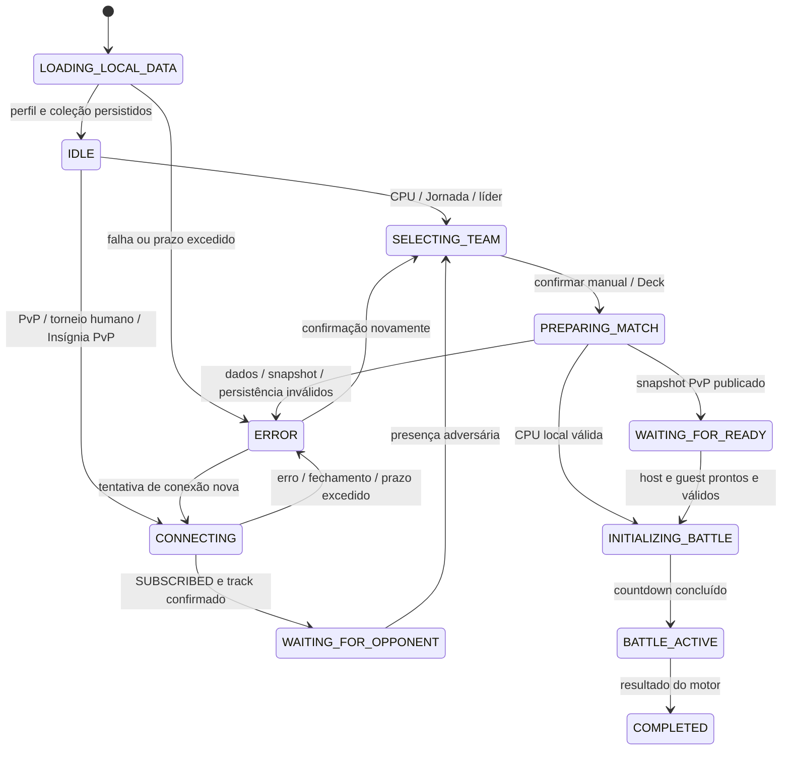

# Gameplay start audit — 2026-10-02

## Current architecture (mapped before edits)

`src/app/batalha/page.jsx` owns mode routing, preparation, room callbacks, result adapters and countdown. `webStore` opens IndexedDB v4, migrates legacy localStorage and durable equipment, normalizes captures (save v7), resolves current equipment, then enriches unresolved rarity over PokeAPI. Manual selection and Decks both produce collection references, reread on READY. `toBattlePokemon` is the pure snapshot adapter. `createBattleState` / `prepareFighter` / `resolveAction` are the canonical shared engine. Presentation consumes engine state/events; wear and consumption persist only the local role.

| Mode | Preparation and opponent | Start authority | Result |
|---|---|---|---|
| CPU | current collection/economy → selected 3 → local difficulty roster | local host → startState → countdown → first turn | CPU reward + local progression |
| Friend PvP | room create/join → battle:PKDX-NNNN → subscribe → track → Presence/team/READY | host requires connected + peer + both valid teams + both READY | host actions/state; owner-local inventory/rewards |
| Tournament H×H | persisted bracket assigns role/room → same PvP adapter | same host gate + mark playing RPC | complete match RPC, bracket, receipts |
| Tournament H×CPU | select 3 → hard CPU → freeze cpu_team RPC | local host, no room/remote READY | match RPC and bracket |
| Tournament CPU×CPU | pending bracket match → simplified random winner | service settlement; no arena/channel | match RPC |
| Badge CPU | challenge/profile → badge validation → local leader roster | local host | three-battle service series |
| Badge PvP | challenge assigns challenger host and persisted room → same PvP | host gate + mark challenge started RPC | three-battle service series/ownership |
| Journey | route/index → CPU mode → local route roster | local host, no Realtime gate | journey progression/loot |

## Lifecycle antes das correcoes

Screen: mode/friend/tournament/badge-intro → team → battle. Preparation is a separate boolean. Connection: IDLE → CONNECTING → SUBSCRIBED → PRESENCE_SYNCING → CONNECTED, with ERROR/CLOSED. Match: lobby → starting ref → countdown → playing → finished. Host alone creates matchId; guest accepts host snapshot with revision/phase validation. READY and team currently have separate Presence and Broadcast sources. Rematch resets these independently.

## Falhas identificadas antes das correcoes

1. Legacy/unresolved rarity blocks `getData` on unbounded network fetch; READY awaits the entire collection. Existing resolved records skip this dependency.
2. Guest republishes selectionTiming on every Presence sync, including its own track; same-value updates can create a perpetual track/sync loop.
3. `readyTeam` has fallible work outside a complete try/finally; CPU generation/normalization/start failures can retain preparingTeam. The durable persistence preflight occurs before the preparation lock.
4. `startState` awaits decorative background fetch before creating any state, without a network deadline.
5. Start validates selected raw host records rather than the frozen READY snapshot; guest snapshots are normalized a second time.
6. Connection retry replaces transport but leaves local READY true while new Presence starts false. Reconnect replays battle only when peer sessionId changes; a missed start in the same session has no explicit snapshot request.
7. Connection has no application deadline for missing subscribe/track callbacks. Room existence is Presence-only; no durable friend-room registry is present.

These are code paths, not attribution of any specific player's report without their traces. Full verification and the final questionnaire follow below after implementation/testing.

## Implementação e evidências

A auditoria encontrou falhas reproduzíveis no código. Não recebemos o stack trace nem o save de um jogador afetado; portanto, não atribuímos todos os relatos a uma única causa comprovada em produção.

Arquivos principais: `page.jsx`, `webStore.js`, `realtime.js`, `pokemon.js`, `lifecycle.js`, `rarity.js`, `durableEquipment.js`. O motor de dano, regras, recompensas e formato dos modos foram preservados.

`getMatchLifecycle` deriva esse estado dos adaptadores existentes. Não é um novo motor paralelo nem uma reescrita de todos os estados React. A conexão continua tendo suas fases próprias; a CPU não as consulta. `COMPLETED` descreve o resultado do motor, não comprova a conclusão de todas as gravações remotas.

### Matriz executada

| Verificação | Evidência | Resultado |
|---|---|---|
| Suíte existente ampliada | `npm run test:battle` | 178 testes passaram |
| Auditoria com imports reais | `npm run test:gameplay-audit` | 10 testes passaram |
| CPU real | 120 seeds por dificuldade, 360 inicializações, até 20 ações legais por partida | passou |
| Dados/equipamentos | manual e referências de Deck, sem itens, estratégico, relíquia, ambos, consumível, durável, aliases antigos, item removido, tipos antigos, durableItems parcial | passou nos fixtures |
| Insígnia no motor | 18 líderes × 3 rodadas | 54 inicializações passaram |
| Jornada no motor | 10 rotas × 3 rodadas | 30 inicializações passaram |
| CPU no navegador | Médio + Deck em desenvolvimento; Fácil + manual e Difícil + Deck em produção | arena ativa |
| PvP Deck × Deck em desenvolvimento | PKDX-5539, host primeiro | mesmo match `60f0198d-93cf-44de-a790-d12d4305d2d0` |
| PvP manual × manual em produção | PKDX-3545, guest primeiro, equipamentos duplos | mesmo match `08a08971-a055-44c3-9e28-b8a387b2607b` |
| Ações PvP em produção | ação do host e do guest | revisão 2 nos dois clientes |
| Refresh/reentrada do guest | PKDX-3545, identidade do IndexedDB preservada | mesmo match e revisão 2 recuperados |
| PvP Deck × Deck em produção | host primeiro, equipamentos duplos | mesmo match `b2d95a90-fdd7-4f04-8497-6d0395c73f53`; o aguardo inicial da ferramenta expirou; a leitura seguinte confirmou a partida |
| PvP manual × Deck em produção | PKDX-3841, READY quase simultâneo | mesmo match `283b5804-2c41-4459-bdcc-43becc19ce1f` |
| PvP Deck × manual em produção | PKDX-5890, guest primeiro, guest móvel | mesmo match `33344e30-fd13-4032-a8b6-9473160cab1b` |
| Viewport móvel | guest: largura 390 px, documento 390 px | sem overflow horizontal no caso testado |
| Torneio híbrido real | PKC-2362, 2 humanos + 2 CPUs, registro bloqueado, prêmios ×0,5 | criou, recebeu participantes e iniciou chave |
| Torneio Humano × CPU real | CPU Atlas, equipe congelada no banco, sem sala PvP | arena ativa, match `316fd44e-b039-4782-9d80-3864dcd29cb3` |
| Build final: PvP Deck × Deck | PKDX-5958, host primeiro | mesmo match `293a3466-949a-4b3f-9155-b27159a6b24f` nos dois clientes |
| Build final: CPU Médio manual | equipe com equipamentos duplos | arena ativa, match `be8e3b95-e8f3-465c-8f28-fe68b0b458d2` |
| Sala sem anfitrião | PKDX-0000 (fora da faixa gerada por hosts) | ERROR com mensagem, Tentar novamente e Voltar; saída para formulário confirmada |
| Encerramento do teste remoto | campeonato temporário PKC-2362 | UI confirmou “Campeonato cancelado. Você já pode criar um novo.” |
| Jornada em produção | Rota 1, primeira batalha, Deck e equipamentos duplos | arena ativa, match `7f565709-8f05-4a6c-8444-e7bdfd2c8b9c` |
| Build | `npm run build` | passou; warnings existentes de dependências/cache |
| Formatação | `git diff --check` | passou |

As duas sessões usaram origens distintas (`localhost:3101` e `127.0.0.2:3101`) no Chrome, com IndexedDB e perfis independentes, conectadas ao Supabase Realtime configurado. Não foram dois dispositivos físicos nem dois processos de navegador. O arquivo temporário de fixture só semeava coleções vazias e foi removido antes do build final. Os fixtures tinham sprites de fallback; isso não foi tratado como falha do motor.

Evidência visual: [PvP móvel em produção](qa/pvp-production.png). O painel de diagnóstico não apareceu na versão de produção, mesmo com `debugBattle=1`.

### Relatório obrigatório — itens 1 a 56

| Nº | Item | Conclusão |
|---|---|---|
| 1 | Arquitetura completa encontrada | Page coordena modos; webStore hidrata/migra; pokemon cria snapshots; engine inicializa/resolve; realtime transporta; services liquidam modos; UI apresenta eventos. Mapa por modo acima. |
| 2 | Lifecycle | Screen + preparação + conexão + fases do BattleState eram fragmentados. Lifecycle derivado agora dá fase e motivo; preserva os adaptadores existentes. |
| 3 | Pipeline CPU | perfil/coleção local → referências atuais → equipamentos válidos → roster local por dificuldade → snapshots → engine → countdown → ações CPU no engine. |
| 4 | Pipeline PvP | código normalizado → papel/identidade → canal → SUBSCRIBED → track → Presence atômica de time/READY → host valida ambos → um BattleState → START/STATE → arena dos dois. |
| 5 | Pipeline torneio | registro/chave remotos; H×H usa PvP; H×CPU congela roster no banco e inicia localmente; CPU×CPU mantém resolução simplificada do service. |
| 6 | Pipeline Insígnia | disputa remota → participante/papel → validação de tipo/raridade → líder local ou PvP compartilhado → resultado de série no service. Continua com 3 batalhas. |
| 7 | Pipeline Jornada | rota/índice → CPU local curada → engine compartilhado → progressão/loot locais. |
| 8 | Causas CPU encontradas | getData aguardava raridade externa sem prazo; startState aguardava fundo decorativo sem prazo; exceções após preparação não tinham finally completo; durabilidade era aguardada antes do lock; metadados de tipos antigos eram normalizados incorretamente. durableItems contendo null também abortava normalização. |
| 9 | Diferenças entre jogadores | saves com raridade resolvida evitavam a rede; registros legados/novos variavam; persistência e rede variavam; equipes/equipamentos podiam selecionar caminhos distintos. São explicações demonstráveis do código, sem atribuição a um dispositivo específico. |
| 10 | Conexão PvP | loop de track/sync do relógio no guest; fila de track antiga podia bloquear reconexão; identidade nova não era criada atomicamente; faltava deadline da tentativa. Não foi encontrado desencontro normal de canal. |
| 11 | READY/start | fontes separadas permitiam estados temporariamente discordantes; host iniciava com seleção em vez do snapshot congelado; REMATCH recebido não liberava o lock de início; falha na validação de Insígnia podia conservar o lock já adquirido. |
| 12 | Código/topic divergentes | não nos caminhos normais rastreados: host gera PKDX-NNNN, guest acrescenta PKDX-, adapter normaliza casing/espaços e usa battle:CODE. Testes e navegação real confirmaram canal compartilhado. Não existe registro durável de sala de amigo. |
| 13 | Cliente Supabase recriado | criado por tentativa de sala; não por cada render. Mantido estável durante seleção/READY. |
| 14 | Canal recriado | create/join/retry/entrada de confronto criam canal. Seleção de Pokémon, Deck ou equipamento não chama connectRoom. |
| 15 | Dependências de effects | não foi encontrado effect de inscrição dependente de equipe/READY. useCallback mudar de identidade não reinscreve o canal, que é criado explicitamente. |
| 16 | Cleanup antigo | active e cliente/canal próprios já evitavam remoção física de um canal novo. Testes agora também cobrem callbacks antigos, geração de tentativa e fila de transporte antiga. |
| 17 | track correto | já ocorria após SUBSCRIBED, e CONNECTED após sucesso do track. Preservado; foram adicionados deduplicação, deadline e isolamento de geração. |
| 18 | Identidade | id persistido, não nome. Criação agora atômica; sessionId de transporte inclui UUID e não apenas contador reiniciado no refresh. |
| 19 | Handshake | novo state_request após inscrição/track permite host reenviar estado atual; recuperação após refresh foi observada. |
| 20 | Sincronização de equipe | READY e time agora vêm juntos da Presence para o lobby; Broadcast não sobrescreve essa verdade com uma versão antiga. BattleState ativo continua no host e é recuperável por snapshot. |
| 21 | Decks | resolvem IDs na coleção corrente. Missing IDs produzem validação explícita. Deck × Deck e ambas as combinações mistas passaram no navegador. |
| 22 | Esquemas de itens | snapshot leva slots, instanceIds e durabilidade; mochila permanece privada. Não houve falha de serialização nos equipamentos válidos testados. |
| 23 | Instâncias duráveis | referências ausentes/quebradas são resolvidas pelas regras existentes; entries null/inválidas agora são ignoradas ao normalizar estoque. Persistência ganhou deadline na preparação. |
| 24 | IndexedDB antigo | migração localStorage e migração durável precedem leitura; DB v4/save v7 preservados. Operações bloqueadas/falhas não são mascaradas como coleção/inventário vazios no caminho de batalha. |
| 25 | Cache de performance | nenhum cache novo de time/inventário foi identificado como causa. READY já reread dados e continua fazendo isso; reservation index e filtros memoizados usam snapshots atuais. Não foi encontrado service worker neste checkout. |
| 26 | Correções CPU | leitura sem enriquecimento irrelevante de raridade; lock imediato; try/catch/finally; deadlines; fundo já carregado; papel host explícito ao escolher CPU; saída do canal anterior. |
| 27 | Correções conexão | deadline de conexão e de anfitrião ausente, isolamento de geração, papel explícito na Presence, session UUID e confirmação de track. |
| 28 | Correções sincronização | fim do eco de relógio, deduplicação de track, snapshot local congelado, fonte única de READY/time do lobby. |
| 29 | Correções READY | snapshot só é confirmado após preparação e publicação válidas; retry da conexão limpa READY local; falha no início permite nova confirmação. Ambos continuam obrigatórios. |
| 30 | Correções MATCH_START | lock liberado no REMATCH recebido; validação de ambos os snapshots; snapshot atual atualizado imediatamente; identidade única do match; envelope room/version/sender. |
| 31 | Reconexão | queue antiga não bloqueia transporte novo; preserva Presence em resubscribe automático; state_request recupera partida. Reentrada manual após refresh recuperou revisão 2. |
| 32 | Cleanup | generation rejeita callbacks e preparação antiga; leave limpa deadline; canal/cliente pertencem à tentativa; mudança de modo limpa canal/timers. |
| 33 | Inicialização BattleState | adaptador corrige types strings, lista vazia com type antigo e stats não-array; validação do snapshot ocorre antes do engine. Fórmula e regras do engine preservadas. |
| 34 | Itens | null em durableItems reparado; wear permanece owner-local/idempotente. Demais regressões de efeitos não foram demonstradas na suíte. Não foi feito novo rebalanceamento. |
| 35 | Torneio | deadline na preparação/freeze da CPU e benefícios do PvP compartilhado. H×CPU e configuração híbrida passaram em serviço real; término da chave e H×H remoto não foram exercitados nesta execução. |
| 36 | Insígnia | erro de validação/início libera lock; chamada de aceite/início tem deadline; raridade indisponível não é persistida como NORMAL. Série e transferência de posse não foram exercitadas remotamente. |
| 37 | Jornada | startup compartilhado corrigido. Rota 1 iniciou no navegador; todas as 30 equipes de rodada iniciaram no engine. Término/loot remoto não se aplica; liquidação local é coberta pela suíte, não por nova partida completa de navegador. |
| 38 | Reparos de saves | campos antigos continuam normalizados, stale equipment segue regras canônicas, durable entries parciais são toleradas, perfil criado atomicamente. Nenhum save real foi apagado e não foi recomendado limpar dados. |
| 39 | Erro/retry | dados locais têm erro recuperável e retry; preparação sempre libera lock; conexão e sala sem anfitrião têm erro com retry/Voltar; CPU em carregamento não recebe mensagem de conexão PvP. |
| 40 | Diagnósticos | lifecycle/reason, playerId, matchId, tipo de evento, room/topic, UUID de tentativa, status e track count no painel opt-in exclusivamente de desenvolvimento. |
| 41 | Matriz CPU | variantes de equipe/equipamento listadas acima passaram. Resolução de referências de Deck é testada no domínio e seleção real de Deck no navegador. |
| 42 | Repetição CPU | 360 partidas com roster real, 120 por dificuldade; ações validadas pelo engine, até 20 por partida. Não significa 360 partidas completas de navegador. |
| 43 | PvP manual × manual | passou em produção, mesmos IDs e revisões após ações. |
| 44 | PvP Deck × Deck | passou em desenvolvimento e produção; o aguardo inicial da ferramenta expirou em um teste, e uma leitura seguinte confirmou a partida; a latência total não foi medida. |
| 45 | PvP misto | manual/Deck e Deck/manual passaram em produção. |
| 46 | Equipamento duplo PvP | estratégico e relíquia duráveis nas equipes de ambos; 5/5 renderizado nos snapshots locais/remotos. |
| 47 | Ordem READY | host primeiro, guest primeiro e quase simultâneo passaram; host sozinho não iniciou no teste observado. |
| 48 | Reconexão | refresh/reentrada do guest recuperou mesma partida e revisão. Falha de track antigo também coberta por teste automatizado. Suspensão real de aparelho e perda de rede física não foram simuladas. |
| 49 | Torneio H×H | trace e testes do adapter compartilhado/serviço; falta uma partida real de torneio entre humanos. PvP entre humanos em produção passou. |
| 50 | Torneio H×CPU | seleção de Deck, freeze remoto e entrada real na arena passaram. Resultado final da semifinal não foi jogado/liquidado nesta execução. |
| 51 | Insígnia | 54 inicializações de líderes e regras/serviços locais testados; falta série remota completa e posse. |
| 52 | Jornada | 30 inicializações e Rota 1 em produção passaram; término de uma rota no navegador não foi exercitado. |
| 53 | Testes atuais | 178 + 10 = 188 testes passaram nas duas commands. |
| 54 | Build produção | passou. Warnings existentes de Browserslist, optional debug/follow-redirects, Sass/autoprefixer e cache webpack dependem do build e estão registrados nos logs. |
| 55 | Diff check | git diff --check passou. Avisos CRLF/LF do Git não são falhas desse check. |
| 56 | Riscos restantes | atribuição aos relatos precisa de trace/save afetado; latência variável; H×H de torneio, finais/recompensas remotas, série/posse de Insígnia, perda física de rede e suspensão de celular ainda não validados end-to-end. Host fechar/recarregar não tem persistência durável completa de uma partida de amigo. Protocolo v2 exige atualização dos dois clientes. Nenhum deploy/migration remota foi realizado. |

### Respostas explícitas A–P

| Pergunta | Resposta baseada nas evidências |
|---|---|
| A — Por que CPU não iniciava? | Há caminhos comprovados de espera ilimitada na raridade/fundo, exceções sem finally e preflight durável antes do lock. Saves duráveis parciais também podiam falhar. Não temos trace individual para atribuir todos os relatos. |
| B — Por que só alguns? | Raridade já resolvida evita fetch; saves/esquemas e rede/persistência variam. Fixtures antigos e falhas de rede/persistência foram testados. |
| C — CPU dependia de multiplayer? | Não foi encontrada uma trava de Presence/READY no ramo CPU. Existiam estado de papel e canal de modo anterior que não eram limpos ao escolher CPU; agora são. |
| D — Por que PvP não conectava? | Loop de Presence e fila antiga de track são falhas rastreadas; perfil novo tinha corrida de identidade; ausência de deadline escondia falhas. Não foi provado que toda desconexão relatada tinha essas causas. |
| E — Seleção recriava canal? | Não no caminho normal atual. connectRoom é chamado explicitamente, não por effect de seleção. Fluxos manual/Deck preservaram a sala. |
| F — Cleanup antigo removia novo? | Não foi encontrado esse defeito físico: cada tentativa tem cliente/canal e active guard próprios. Callbacks e queues obsoletos foram isolados e testados. |
| G — IDs de sala iguais? | Sim nos caminhos rastreados/testados, com PKDX- e battle:CODE. |
| H — Presence após SUBSCRIBED? | Sim, antes e depois da correção; CONNECTED só após track bem-sucedido. |
| I — READY visual e snapshots discordavam? | Havia duas fontes independentes e seleção raw separada do snapshot. Agora lobby usa Presence atômica e host usa snapshot congelado. |
| J — Ambos READY sem início? | Além da conexão/snapshot, o lock não era liberado no REMATCH recebido; falhas de validação de Insígnia podiam conservá-lo. Foram corrigidos. |
| K — START único e recuperável? | Host mantém lock por partida e cria único matchId. Foi adicionada solicitação de snapshot; refresh/reentrada recuperou mesma revisão. Perda artificial isolada de um pacote START não foi injetada no navegador. |
| L — Item/Durabilidade quebrava snapshot? | Nenhuma falha em snapshots duplos válidos foi reproduzida. Entry durável null abortava hidratação; preflight sem prazo podia travar antes do start. Ambos corrigidos. |
| M — Cache de performance causou stale state? | Não foi encontrada evidência disso. Dados são relidos no READY; refs/snapshots e fontes de protocolo eram problemas distintos. |
| N — Saves antigos contribuíam? | Podiam, por raridade pendente, tipos antigos e hidratação/equipamento parcial. Fixtures passaram; nenhum save de jogador afetado foi fornecido. |
| O — CPU pode iniciar repetidamente? | Sim no escopo verificado: 360 inicializações reais de domínio e Fácil/Médio/Difícil no navegador, sem gate Realtime. |
| P — Duas sessões criam/juntam/Deck/READY/mesmo match? | Sim nos testes com origens/IndexedDB/perfis independentes e Realtime real em desenvolvimento/produção. Isso não comprova todos os navegadores, versões ou aparelhos. |

### Limites e reprodução

Executar `npm run test:battle`, `npm run test:gameplay-audit`, `npm run build` e `git diff --check`. A segunda command usa um loader de aliases para importar os módulos reais do app sem mocks de roster/engine.

HMR durante edição invalidou uma conexão de desenvolvimento no meio de um teste; o caso foi descartado como teste de reconexão e refeito na versão de produção sem edições simultâneas. Também houve uma tentativa de fixture que criou um schema incompleto em uma origem descartável; ela foi substituída por uma nova origem corretamente inicializada, sem usar limpeza de dados como correção do jogo.

As skills game-ui-ux e ui-ux-pro-max foram lidas/aplicadas à separação estado/apresentação e feedback recuperável. mobile-game-battle-ui não foi encontrada no projeto nem nos diretórios de skills pesquisados; não foi necessária uma alteração visual para esta correção.
