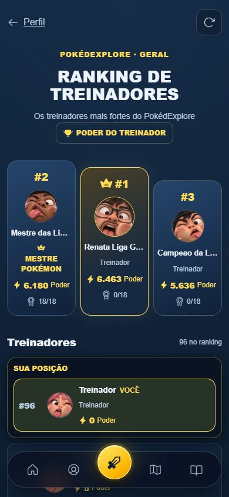
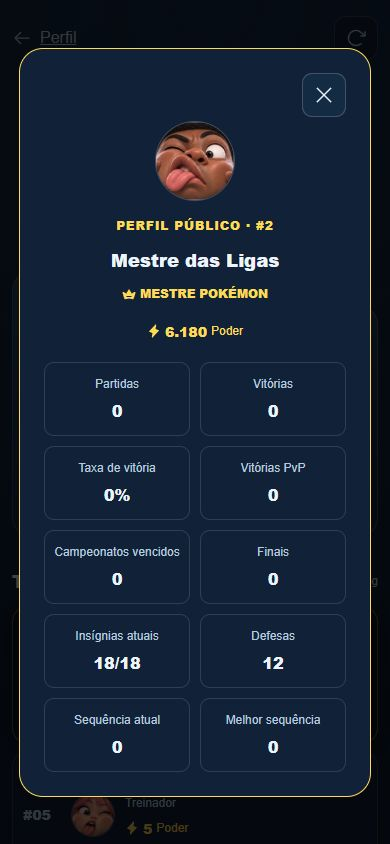
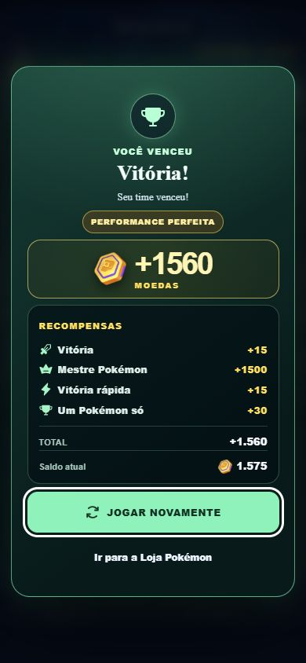
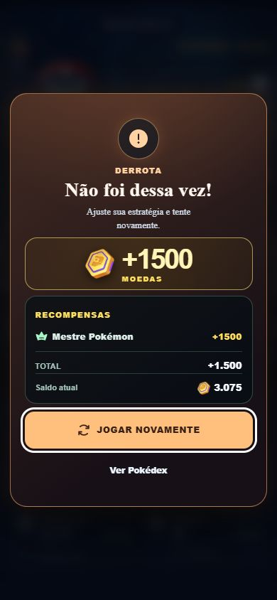

# Ranking global e Mestre Pokémon — implementação

Implementado em 2026-10-02 seguindo a decisão explícita: jogo sem login, identidade existente e ranking social com resultados individuais enviados pelo cliente. Não é um sistema antifraude. Nenhum dado de produção foi escrito durante a validação.

## Relatório obrigatório

1. **Migration criada:** `supabase/migrations/20261002_trainer_ranking.sql`, transacional, dependente das migrations existentes de Insígnias e torneios. Testada executando SQL real em PostgreSQL/WASM (PGlite).
2. **Migration remota:** NÃO aplicada nesta execução. O estado instalado no Supabase remoto não foi consultado. A disponibilidade compartilhada depende da aplicação desta migration; testes locais não comprovam implantação, Realtime ou RLS remota.
3. **Tabelas:** reutiliza `competitive_players`, `badges`, `badge_history`, `badge_challenges`, `badge_challenge_battles`, `tournaments`, `tournament_players`, `tournament_matches`. Adiciona `avatar_id` ao perfil existente. Cria `competitive_ranking_rules`, `competitive_trainer_stats`, `competitive_match_results`, `competitive_reward_receipts`, `competitive_tournament_receipts`, `competitive_badge_achievements` e a view `public_trainer_ranking`.
4. **RPCs:** novas públicas `sync_trainer_ranking_profile`, `submit_competitive_result`, `get_trainer_ranking`, `get_public_trainer`. Helpers privados `has_pokemon_master_title`, `calculate_trainer_power`, `refresh_trainer_badge_stats`, `settle_competitive_result`; três funções de triggers para Insígnias, partidas canônicas e eventos de torneio. Reutiliza a liquidação existente de desafios, final/semifinal e expiração de Insígnias.
5. **RLS/permissões:** todas as seis tabelas novas têm RLS. Somente agregados/view têm SELECT público; sem escrita direta para `anon`/`authenticated`. Ledgers, recibos e configuração privados. Todas as novas funções revogam o EXECUTE padrão de PUBLIC e usam `search_path=''`; só quatro RPCs recebem EXECUTE público. Três RPCs existentes de perfil/atividade/desafio recebem search_path seguro. Políticas antigas de torneio e a confiança das RPCs existentes permanecem; isso não constitui proteção antifraude.
6. **Ledger de resultados:** chave `(match_id, player_id)`; `mode` CPU/PVP/JOURNEY/TOURNAMENT/BADGE, `result` WIN/LOSS, adversário, conclusão e criação. Valida formato dos IDs, enums, combinações de adversário, limites de nome/avatar e timestamp futuro. CPU/Journey não recebem adversário humano; PvP exige adversário distinto. O cliente nunca envia totais de vitórias, poder ou moedas.
7. **Idempotência:** resultado, contadores, streak, poder e recibo são liquidados na mesma transação SQL. ON CONFLICT impede recontagem permanente; duplicata contraditória é rejeitada. Uma duplicata retorna o mesmo recibo original, mesmo depois de mudança de título. Reconquistar as Insígnias não concede bônus retroativo a uma partida já liquidada sem recibo.
8. **Perfil público:** ID/nome/avatar, partidas/vitórias/derrotas, agregados CPU/PvP/Journey, torneios, Insígnias atuais/conquistadas/defesas, streak atual/melhor, poder, título, última batalha e atualização. RPC acrescenta posição. Não publica Bag, inventário, moedas, Pokémon, equipe, equipamentos, sala ou save.
9. **Poder exato**, calculado somente em SQL, com pesos na configuração privada:

   ```text
   floor(
     5*min(cpu_wins,100) + 10*min(journey_wins,100) + 60*pvp_wins
     + 500*tournament_wins + 120*tournament_finals
     + 20*min(tournament_entries,50)
     + 250*badges_current + 40*badges_earned_lifetime + 80*badge_defenses
     + 20*min(best_win_streak,10)
     + 1000*max(0,(W+5)/(N+10)-0.5)*N/(N+20)
   )
   W = vitórias PvP + vitórias em partidas de torneio + vitórias de desafio
   N = partidas PvP + partidas de torneio + partidas de desafio
   ```

   Moedas, raridade da coleção e quantidade bruta de batalhas não entram na fórmula. Exemplos reais do teste SQL: PvP 100V/20D **6463**; Mestre com 18 atuais/18 históricas/12 defesas **6180**; torneios 8 títulos/10 finais/12 entradas **5636**; 10000 vitórias CPU **700**; iniciante PvP 1V/0D **82**.
10. **CPU:** 5 pontos por vitória até 100 vitórias = 500. A contribuição de melhor sequência é global, limitada a 200. Assim, somente CPU chega no máximo a 700; 10000 vitórias não aumentam esse teto. Os contadores continuam verdadeiros, sem truncar o histórico. Journey tem seu próprio teto de 1000 pontos por vitórias.
11. **Win rate:** a taxa exibida é o percentual bruto geral arredondado, com 0 quando não há partidas. O componente de poder usa prior de 10 partidas a 50% e fator de amostra `N/(N+20)`, apenas modos competitivos. CPU/Journey não inflacionam esse componente; 1/1 não gera o mesmo bônus que uma amostra extensa.
12. **Desempates:** poder DESC → vitórias PvP DESC → campeonatos vencidos DESC → defesas DESC → vitórias totais DESC → ID ASC com collation C. A mesma ordem é usada na lista, pódio e posição individual.
13. **Insígnias:** 250 por posse atual (18 = 4500), 40 por código canônico já conquistado (18 = 720), 80 por defesa histórica. Histórico de defesa vem de `badge_history`, preservando o reset de `defense_count` em transferências. Um ledger por jogador/código preserva conquistas mesmo após perder a posse.
14. **Torneios:** campeão 500, finalista 120, entrada 20 até 50. Entrada representa participação registrada, inclusive em torneio posteriormente cancelado, com contribuição limitada. Título/final exigem conclusão canônica. Partidas FINISHED alimentam resultados individuais humanos via trigger. Eventos únicos por `(tournament_id,player_id,event_type)`. CPUs não entram no ranking. Recompensas locais de torneio e regras de semifinal/final permanecem intactas.
15. **Jogadores existentes:** preserva `trainer-profile.playerId`, nome/avatar e todo o IndexedDB. Perfis públicos existentes recebem linha de agregados; saves ainda não presentes no servidor sincronizam a mesma identidade na abertura. Não cria outra identidade nem exige login. Nenhuma alteração de versão do banco local.
16. **Backfill:** apenas posse atual, códigos históricos de INITIAL_CLAIM/TRANSFER e defesas existentes. Partidas, vitórias, derrotas, streaks e campeonatos começam em zero. Não transforma totais locais, atividade antiga ou torneios antigos em partidas inventadas. Torneios em andamento no momento da implantação podem registrar entrada na conclusão futura.
17. **Helper Mestre:** mantém `pokemonMaster.js`, `BADGE_CONFIG`, a constante +1500 e os quatro testes anteriores. Perfil usa o helper de posse atual; a migration deriva seus códigos das 18 linhas canônicas já existentes. SQL determina elegibilidade de pagamento, sem confiar numa flag local.
18. **Sincronização de posse:** triggers de `badges.owner_player_id` e `badge_history` atualizam título/agregados dos donos afetados na mesma transação. 18/18 ativa; 17/18 remove; recuperação reativa. A liquidação elegível trava as linhas de Insígnias para observar posse consistente; a RPC libera posse expirada antes da avaliação. Perfil mantém a assinatura existente; ranking atualiza ao abrir/recarregar. Rede/offline pode atrasar a apresentação. Toast/celebração são apresentação local, registrados somente na transição false→true, sem conceder moedas por renderização.
19. **Elegibilidade +1500:** conclusão natural CPU/PvP/Journey, vitória OU derrota, com todas as 18 Insígnias atuais no momento da primeira liquidação SQL. Cliente normal exige estado finished, vencedor válido, equipe derrotada sem HP, equipe vencedora viva, revisão e horários de início/fim válidos. Exclui abandono, cancelamento, forfeit, tela anterior ao combate e desconexão sem conclusão natural. Tournament/Badge nunca recebem esse bônus.
20. **Recibo servidor:** UUID e unique `(match_id,player_id,reward_type)`, tipo POKEMON_MASTER_BATTLE_BONUS, valor 1500, FK ao resultado permanente. Nunca usa as janelas locais antigas de 100/250 IDs como garantia competitiva.
21. **IndexedDB:** fila persistente de eventos compactos, ordenada por conclusão e escopada ao dono. Aplicação valida recibo/jogador/partida/tipo/valor. Uma transação atualiza carteira, grava recibo permanente e settlement e remove o evento pendente; sem limpar inventário, coleção ou save. Troca de dono não aplica moedas. Retry em online/foco/novo resultado/alteração de perfil, sem polling. Resultado exibe linhas normais, Mestre +1500, total e saldo; Journey utiliza seu prêmio efetivo e eventual baú. Fora do resultado, crédito tardio tem toast.
22. **Outros dispositivos:** carteira continua local. Recibo único no servidor e registro local protegem o processamento normal no mesmo save; não existe carteira global nem reivindicação autenticada entre dispositivos. Copiar uma identidade para dois bancos locais distintos, apagar o save ou restaurar backup antigo pode permitir reaplicação local de um recibo. Exportação atual inclui os novos registros; rollback de backup antigo não é uma garantia distribuída.
23. **Rota:** `/ranking`, página independente com metadata, carregamento, vazio, erro e retry em português.
24. **Pódio:** ordem visual #2/#1/#3, ouro/coroa para #1, avatar, nome truncado, título, poder e Insígnias. Identidade visual existente preservada.
25. **Lista:** páginas de 20, máximo RPC 50 e offset limitado; nomes/avatar, poder, Insígnias, vitórias e taxa. Paginação não baixa todos os jogadores; não lê a coleção local. Índice composto acompanha a ordenação. Posição individual conta jogadores à frente no servidor, não é O(1); offset/count têm custo crescente em uma base extensa.
26. **Sua posição:** destaque VOCÊ na linha/pódio ou cartão sticky quando está fora das linhas carregadas. Validado com jogador #96 fora do top 23; sem criar uma sexta aba no menu inferior.
27. **Detalhes:** dialog nativo com nome/avatar, título/poder e agregados públicos. Uma consulta ao abrir, sem consulta por linha. Foco contido, Esc fecha e retorna ao botão de origem; botão fechar tem alvo 44px.
28. **Navegação:** CTA RANKING GLOBAL no Perfil → `/ranking`; voltar ao Perfil no topo. Menu inferior existente continua com cinco destinos.
29. **QA móvel:** Chrome local, viewports 320/360/375/390/412/430 × 844. Ranking e modal de derrota sem overflow horizontal em todas; pódio em três colunas, texto principal 14px, selo 12px, botões dentro da viewport. Paginação 20→40 sem duplicatas, posição própria, dialog/foco/Esc, erro/retry/vazio/carregamento e link do Perfil verificados. Adapter HTTP temporário executou as RPCs da migration real no PGlite isolado. Fixture temporária resolveu vitória/derrota com o motor real e renderizou BattleArena real. Vitória: saldo inicial 15 + prêmio normal 60 + bônus 1500 = 1575; recarga manteve 1575. Derrota subsequente: +1500 = 3075, sem prêmio de vitória. Fixtures/adapter removidos; servidores encerrados; viewport restaurada. Isso é QA de viewport local, não dispositivo físico nem dois clientes Supabase hospedados.
30. **Testes:** 17 testes SQL novos (baseline, duplicatas, modos, transferência/expiração, exclusões, RPCs canônicas, fórmula/desempate, RLS/permissões, perfil/paginação/privacidade e confiança casual explícita); 4 de eventos/recibos; 6 IndexedDB (aplicação concorrente, 260 recibos, dono, validação, fila e celebração). Mais os 4 testes do helper preservados. PostgreSQL executa migrations reais; mocks de IndexedDB usam os métodos reais de `webStore`.
31. **Total:** **242 aprovados**: battle 178 + gameplay-audit 10 + equipment 8 + mobile-start 15 + ranking 31. Falhas 0. Teste local específico verifica 10000 + prêmio normal 60 + 1500 = 11560 uma vez, mantendo inventário/identidade.
32. **Build:** `npm run build` aprovado, rota `/ranking` incluída. Warnings existentes de Sass/Browserslist/Axios permanecem; ambiente Node 24, projeto declara 22. DevDependencies PGlite/fake-indexeddb são exclusivas de teste. Não houve deploy.
33. **Diff:** `git diff --check` aprovado. Nenhum fixture, URL/chave QA ou servidor local entra no código final; `.env` não foi alterado.
34. **Limites:** resultado manual de cliente modificado continua possível e é demonstrado num teste executando a RPC como anon. IDs públicos não provam posse, RLS não autentica resultado nem impede personificação. APIs antigas de torneio/desafio herdam confiança casual. Rede pode atrasar bônus e apresentação; um resultado concluído offline é elegível conforme a posse na liquidação, sem reconstruir posse passada. Streak segue a ordem de entrada no servidor (fila local cronológica); dispositivos offline distintos podem chegar fora de ordem. Não há validação remota, stress multi-conexão, Realtime de produção, QA de PvP entre dois clientes ou torneio com quatro clientes nesta execução.

## Respostas explícitas

| Item | Resposta |
|---|---|
| A. Totalmente cheat-proof? | **NÃO.** Ranking casual, conforme autorizado. |
| B. Processamento normal duplica resultado? | **NÃO.** Chave permanente servidor. |
| C. Processamento normal duplica +1500? | **NÃO.** Recibo servidor único + aplicação local atômica permanente, no mesmo save. |
| D. Continua sem login? | **SIM.** |
| E. Preserva playerId? | **SIM.** |
| F. 18/18 ativa Mestre? | **SIM.** Cada código canônico atualmente possuído. |
| G. 17/18 remove? | **SIM.** |
| H. CPU/PvP/Journey concluídos elegíveis? | **SIM**, vitória ou derrota, com título ativo na liquidação. |
| I. Torneio/Desafio excluídos do +1500? | **SIM.** |
| J. Moedas calculam Poder? | **NÃO.** |
| K. Farm CPU domina apenas por volume bruto? | **NÃO.** CPU 500 + streak no máximo 200. |
| L. Documenta falsificação deliberada? | **SIM**, inclusive teste explícito. |

## Evidências locais








